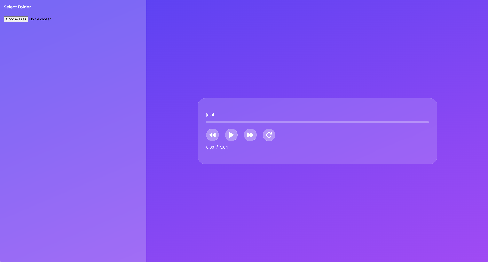

# 🎵 Audio Player

A modern and lightweight audio player that allows users to play, organize, and manage their audio library seamlessly.

---

## Features

- Play local audio files (MP3, WAV, AAC)
- Playlist creation and management
- Repeat modes
- Seek, pause, resume, and skip tracks
- Display track information (title)
- User-friendly interface with intuitive controls

---

## Screenshots




---

## Tech Stack

- Language: HTML / CSS / JavaScript
- Audio Playback: Web Audio API
- UI: Custom

---

## Installation

1. Clone the repository:

```bash
git clone https://github.com/yourusername/music-player.git
cd music-player
```

2. Access via Netlify URL
   [Click Here](je-audio-player.netlify.app)

